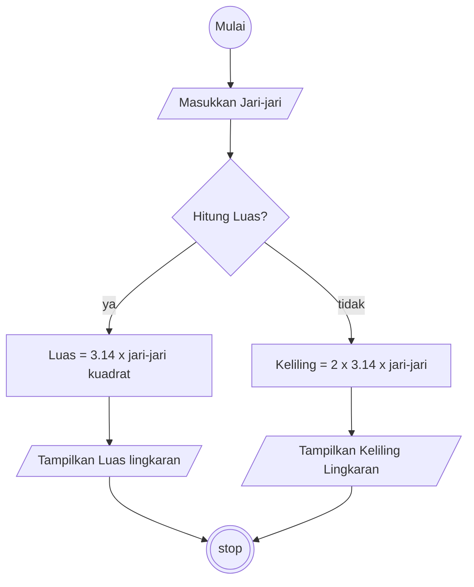

# Algoritma

## Algoritma Desriptif

### Luas dan Keliling Lingkaran

```
1. Mulai
2. Masukkan jari-jari lingkaran
3. Jika menghitung keliling maka hitung keliling lingkaran dengan mengalikan jari-jari tersebut dengan 2 x 3.14
4. Tampilkan hasil keliling lingkaran
5. Jika menghitung luas lingkarannya adalah mengalikan 3.14 dengan hasil jari-jari kuadrat.
6. Tampilkan hasil luas lingkaran
7. Selesai
```

## Flowchart

### Luas dan Keliling Lingkaran



## Pseudo Code

```pseudocode
DECLARE R : REAL
DECLARE Luas : REAL
DECLARE Keliling : REAL
CONSTANT Phi = 3.14
DECLARE PilihPerhitungan : STRING

INPUT R

Luas <- Phi * r * r
Keliling <- 2 * Phi * r

IF PilihPerhitungan = Luas
    OUTPUT "Hasil Luas = ", Luas
Else
    OUTPUT "Hasil Keliling = ",Keliling
ENDIF

```
