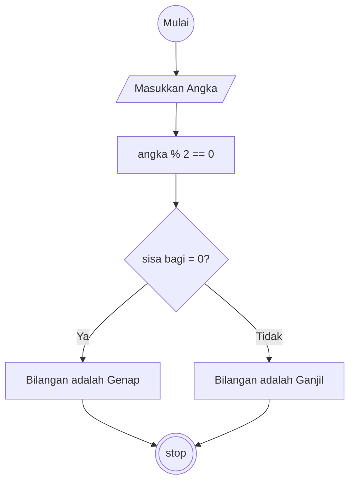

# Algoritma

## Algoritma Deskriptif Ganjil Genap

### Check Ganjil Genap

```
1. Mulai
2. Masukan Bilangan
3. Lakukan check bilangan menggunakan modulo
4. Jika bilangan habis dibagi 2 maka bilangan tersebut Genap
5. Jika bilangan tidak habis dibagi 2 maka bilangan tersebut bilangan Ganjil
6. Selesai
```

## Flowchart Ganjil Genap

### Check Ganjil Genap


